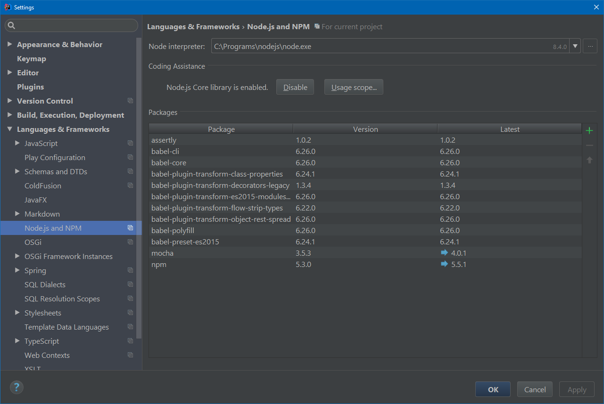
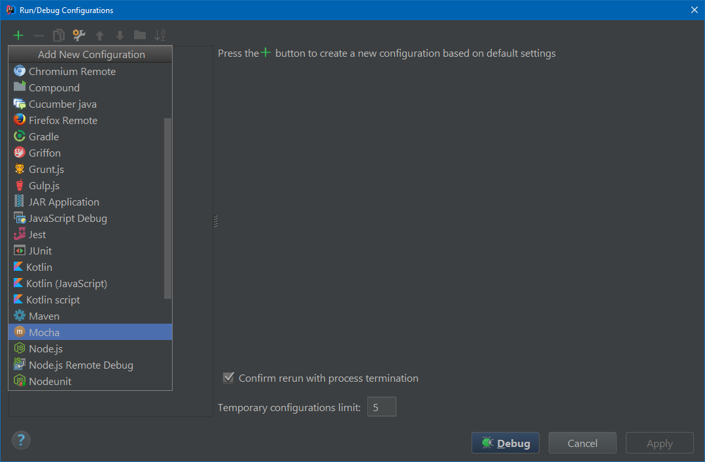
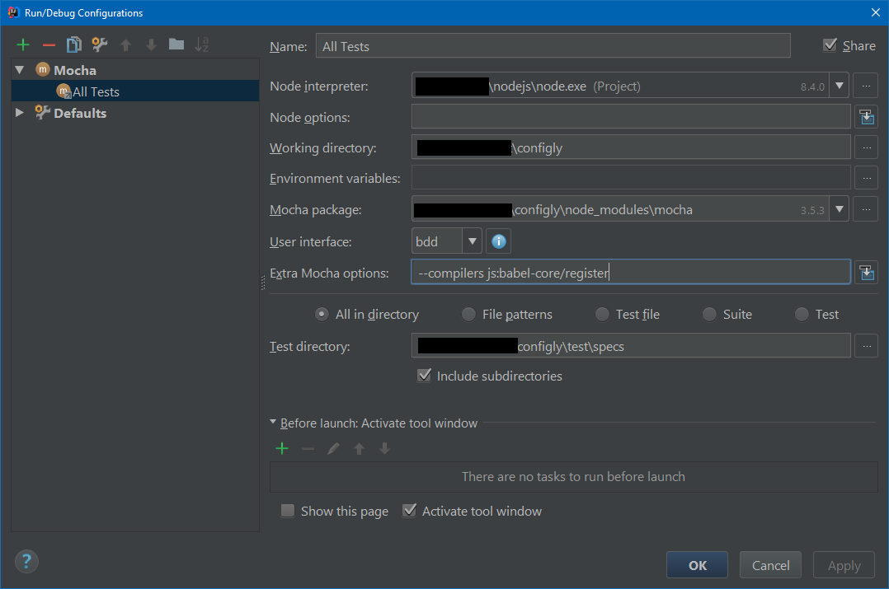
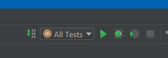
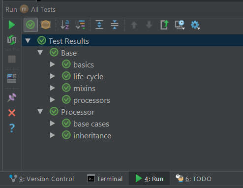

# Development Setup

In order to do development on Configly, you will need to enable Babel in your dev
environment,

## JetBrains (IntelliJ etc.)

Read [this](https://www.jetbrains.com/help/idea/testing-javascript-with-mocha.html) article
and be sure to enable Node.js plugin for the project:

To create a Mocha run configuration:

 - Open the **Run/Debug Configuration** dialog box (Run|Edit Configurations on the main menu).
 - Click the `+` on the toolbar and select `Mocha` from the list.
   - The **Run/Debug Configuration: Mocha** dialog box opens.

 - Enable Babel for the test run by putting `--compilers js:babel-core/register` in the
  `Extra Mocha options` field.

 - Specify the `Node interpreter` to use and the location of the mocha package.
 - Specify the tests to run. This can be a specific test or suite, an entire test file,
  or a folder with test files. You can also define patterns to run only the tests from
  the matching files.

After creating the Run config you should see it in the run tool on the toolbar:

After clicking the Run (or Debug) button, you will see the results in the Run tool window:

